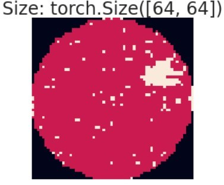
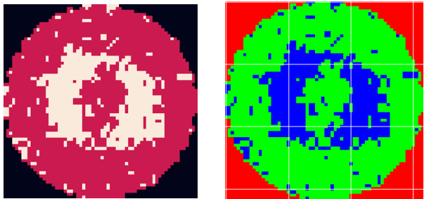

# 딥러닝을 이용한 웨이퍼 맵 결함 검출 자동화
***
# 프로젝트 목표
같은 결함 패턴을 가지는 웨이퍼 맵의 경우 같은 공정 및 설비의 영향을 받았을 가능성이 큽니다. 웨이퍼 맵의 오분류로 불량의 원인을 잘못 파악할 경우 시간과 비용이 낭비될 것입니다. 때문에, 복잡한 반도체 공정에서의 결함 원인 파악을 위해 올바른 웨이퍼 맵의 결함 탐지는 매우 중요합니다. 이를 바탕으로 높은 정확도로 웨이퍼의 결함을 분류하는 기계학습 모델의 연구가 진행되고 있습니다. 이 프로젝트에서는 딥러닝을 이용하여 자동화된 결함 탐지를 위한 모델을 제안할 것입니다.


***
# 데이터셋 소개
본 연구에는 반도체 웨이퍼 맵 데이터 세트인 WM-811K를 사용합니다.

데이터는 https://www.kaggle.com/datasets/qingyi/wm811k-wafer-map 에서 확인 가능합니다.
***
WM-811K는 실제 제조 현장 46,393개의 로트에서 수집된 811,457개의 웨이퍼 이미지입니다.

이 데이터 세트는 811,457개의 웨이퍼 맵과 함께 웨이퍼 다이 크기, 로트 이름 및 웨이퍼 인덱스와 같은 추가 정보로 구성되어 있습니다.

811,457개의 이미지 중 172,950개의 이미지에만 레이블이 있으며 총 9개의 레이블이 있습니다. 이 이미지 중 None이 전체의 85.2%를 차지합니다.

다음은 연구에 클래스별 데이터 수 입니다.   
Class 'Center': 4294   
Class 'Donut': 555   
Class 'Edge-Loc': 5189   
Class 'Edge-Ring': 9680   
Class 'Loc': 3593   
Class 'Near-full': 149   
Class 'Random': 866   
Class 'Scratch': 1193   
Class 'None': 10000
이 중 80%를 train set로 20%를 test set로 사용합니다.

***
# 데이터 전처리
Data_Preprocessing.ipyng를 통해 기존 LSWMD.pkl 파일을 전처리하여 Withpattern Labeled Data와 Nonepattern Unlabeled Data를 학습에 사용하였습니다.
```
df['failureNum'] = df.failureType
mapping_type={'Center':0,'Donut':1,'Edge-Loc':2,'Edge-Ring':3,'Loc':4,'Random':5,'Scratch':6,'Near-full':7,'none':8}
df=df.replace({'failureNum':mapping_type})
```
WM-811K DataFrame의 FailureType Column에는 결합 패턴에 대한 문자열 데이터 정보를 Center : 0, Donut : 1, Edge-Loc : 2, Edge-Ring : 3, Loc : 4, Random : 5, Scratch : 6, Near-full : 7 로 변환한 FailureNum column을 생성하여 원 핫 인코딩 적용이 가능하게 합니다.

```
def resize(data, Dim0, Dim1):
    transTensor = transforms.ToTensor()
    resizer = transforms.Resize((Dim0, Dim1))
    rwm = torch.ones((1, Dim0, Dim1)).to(DEVICE)
    for i in range(len(data)):
        a = transTensor(data[i].astype('int32'))
        a = resizer(a).reshape((1, Dim0, Dim1)).to(DEVICE)
        rwm = torch.cat([rwm, a])
    x = rwm[1:]
    del rwm
    return x
```
각기 다른 차원의 데이터 이미지를 동일하게 resize합니다.
```
resized_images = resize(tensor_data,64,64)
```

```
def rgb_sw(x): #rgb 추가
  Dim0 = np.size(x, axis=1) 
  Dim1 = np.size(x, axis=2)
  new_x = np.zeros((len(x), Dim0, Dim1, 3)) # 0으로만 이루어진 array 생성
  x = torch.unsqueeze(x,-1) # 차원이 1인 차원 생성
  x = x.to(torch.device('cpu'))
  x = x.numpy()
  for w in range(len(x)): 
      for i in range(Dim0):
          for j in range(Dim1):
              new_x[w, i, j, int(x[w, i, j])] = 1
  return new_x

resized_images = rgb_sw(resized_images)
```
1차원의 이미지를 3차원의 이미지 형태로 만들어 각 픽셀별로 0은 웨이퍼가 아닌 부분, 1은 정상 웨이퍼 부분, 2는 결함 웨이퍼 부분으로 각각 R(빨강), G(초록), B(파랑)으로 정의합니다.

***

# 오토인코더
```
autoencoder = str(input('오토인코더 사용여부 O/X == '))
```
자세한 설명에 앞서 오토인코더 기법을 사용하고자 하면 index 5에서 O, 아니면 X를 입력하시면 됩니다.
```
class ConvAutoEncoder(nn.Module):
    def __init__(self):
        super(ConvAutoEncoder, self).__init__()
        
        # Encoder
        self.cnn_layer1 = nn.Sequential(
                        nn.Conv2d(3, 16, kernel_size=3, stride=1, padding=1),
                        nn.ReLU(),
                         nn.MaxPool2d(2,2))

        self.cnn_layer2 = nn.Sequential(
                                nn.Conv2d(16, 32, kernel_size=3, stride=1, padding=1),
                                nn.ReLU(),
                                 nn.MaxPool2d(2,2))

        # Decoder
        self.tran_cnn_layer1 = nn.Sequential(
                        nn.ConvTranspose2d(32, 16, kernel_size = 2, stride = 2, padding=0),
                        nn.ReLU())

        self.tran_cnn_layer2 = nn.Sequential(
                        nn.ConvTranspose2d(16, 3, kernel_size = 2, stride = 2, padding=0),
                        nn.Sigmoid())
            
    def encoder(self, x):
        encode = self.cnn_layer1(x)
        encode = self.cnn_layer2(encode)   
        return encode
    
    def decoder(self, x):
        decode = self.tran_cnn_layer1(x)
        decode = self.tran_cnn_layer2(decode)
        return decode

    def forward(self, x):
        output = self.encoder(x)
        output = self.decoder(output)
        return output
```
오토인코더를 사용하여 데이터의 수를 증강시킵니다.

```
args = {
	'BATCH_SIZE': 16,
        'LEARNING_RATE': 0.001,
        'NUM_EPOCH': 10
        }
```

```
model = ConvAutoEncoder().to(DEVICE)
print(model)
criterion = nn.MSELoss()
optimizer = torch.optim.Adam(model.parameters(), lr=args['LEARNING_RATE'])
```
하이퍼파라미터를 조정할 수 있습니다.

```
def gen_data(wafer, label):
  gen_x = torch.zeros((1, 3, 64, 64))
  with torch.no_grad():
    encoded_x = model.encoder(wafer).to(torch.device('cpu'))
    # dummy array for collecting noised wafer 
    # Make wafer until total # of wafer to 2000
    for i in range((1000//len(wafer)) + 1):
      noised_encoded_x = (encoded_x + torch.from_numpy(np.random.normal(loc=0, scale=0.1, size = (len(encoded_x), 32, 16, 16))).to(torch.device('cpu'))).to(DEVICE)
      noised_decoded_x = model.decoder(noised_encoded_x.float()).to(torch.device('cpu'))
      gen_x = torch.cat([gen_x, noised_decoded_x], axis=0)
    # also make label vector with same length
    gen_y = np.full((len(gen_x), 1), label)
    # return date without 1st dummy data.
  del encoded_x, noised_encoded_x, noised_decoded_x
  return gen_x, gen_y
```
인코더를 사용하여 데이터의 잠재표현을 추출한 뒤 gen_data 함수를 사용해 증강시킬 데이터의 개수를 조절할 수 있습니다. 
***

# 모델 학습
모델은 resnet, WRN, DRN, vgg를를 사용하였습니다.

다음은 best_model을 save 하고 불러오는데 필요한 코드입니다. 
```
import os

# create 'outputs' directory if it doesn't exist
if not os.path.exists('outputs'):
	os.makedirs('outputs')

# specify model saving path relative to 'outputs' directory
model_path = 'outputs/best_model.pt'
```
train을 위해서는 index 33의 load를 False로, 학습을 통해 얻은 outputs 파일의 best_model을 불러와 Test 결과만 보고싶다면 True로 지정하여 실행하면 됩니다.
```
load = True/False
```
***

# FixMatch
언라벨 데이터를 FixMatch 기법 사용으로 학습에 사용했습니다.

기본 FixMatch만 사용시
```
python train.py --imb_ratio_l 1
```
DARP(Distribution Aligning Refinery of Pseudo-label) 추가하여 학습시
```
python train.py --darp --warm 40 --alpha 2 --imb_ratio_l 1
```
***
